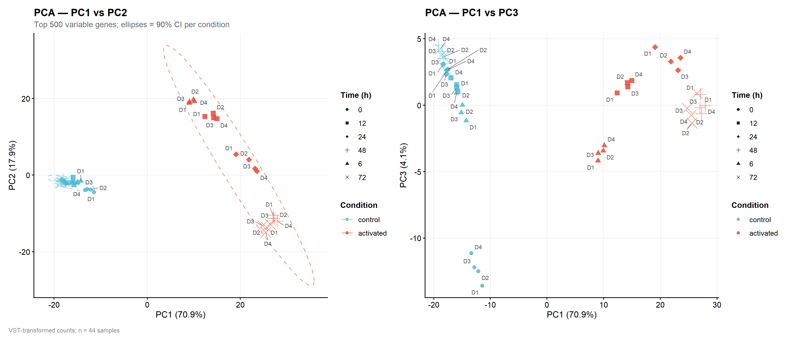
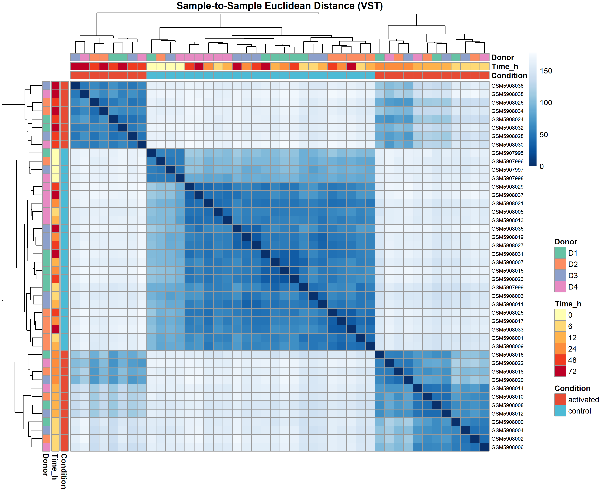
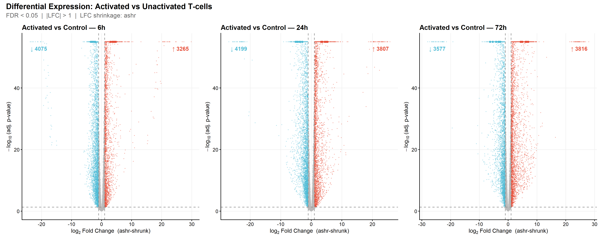
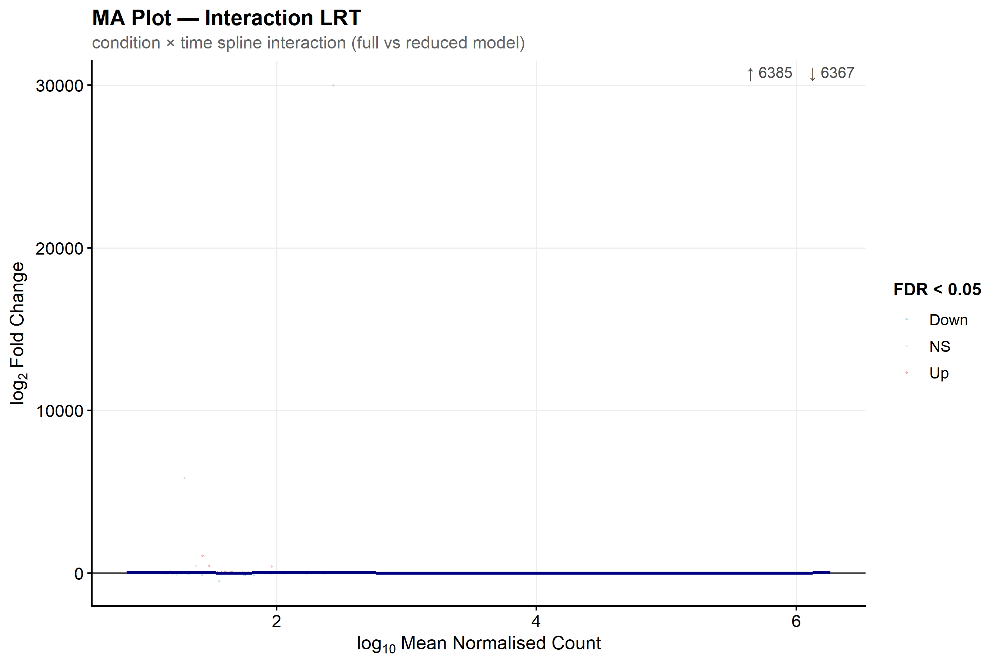
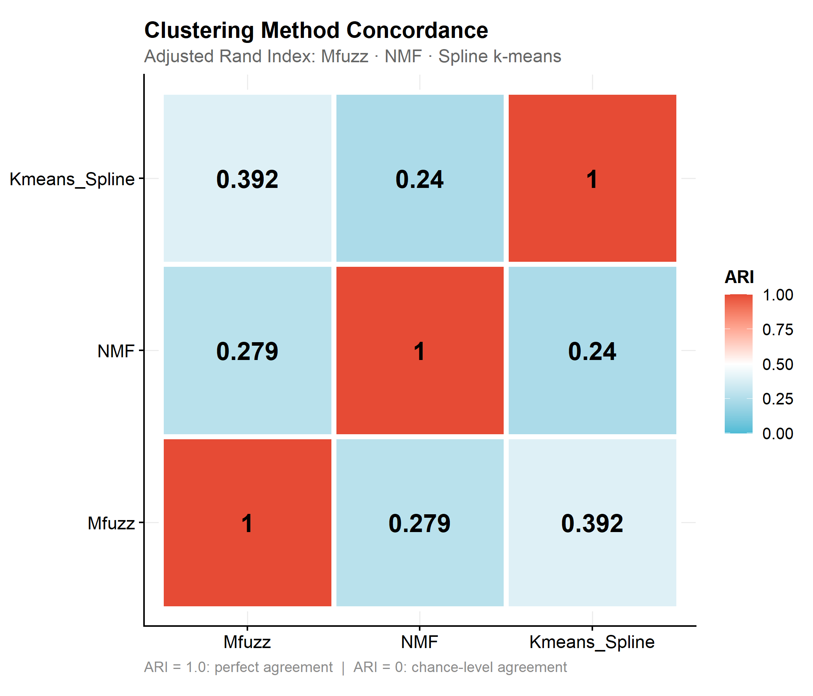
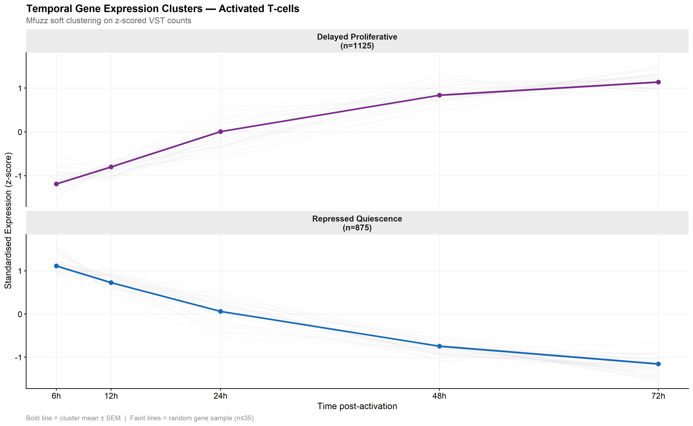
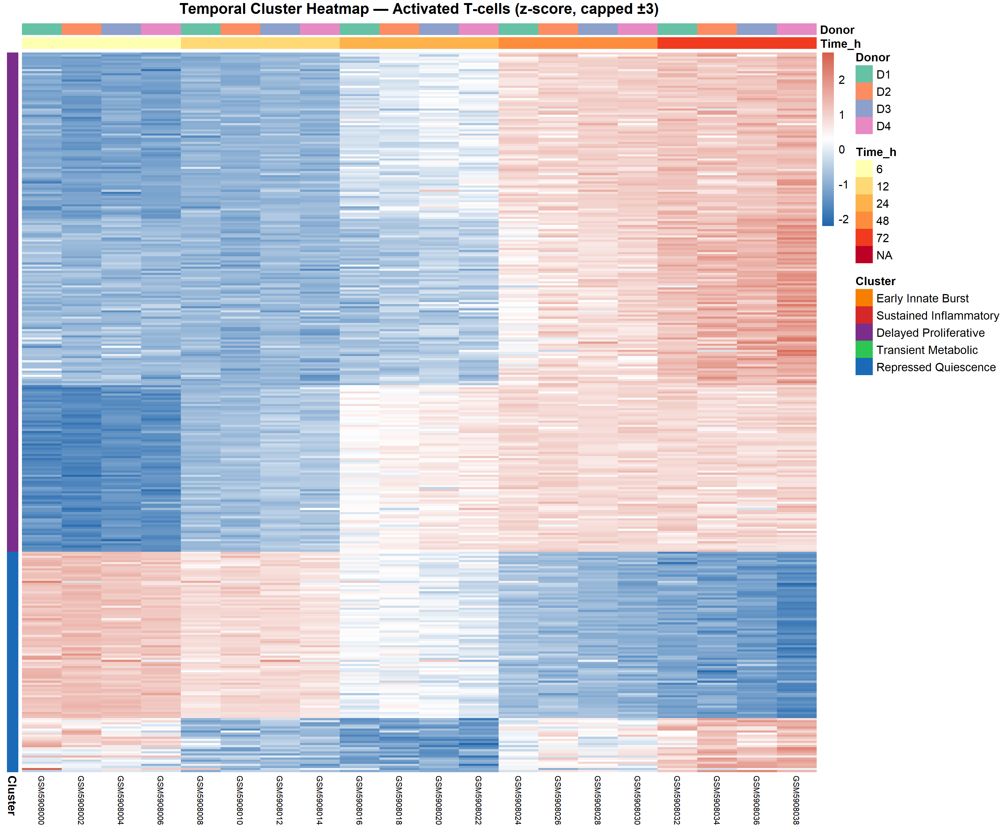
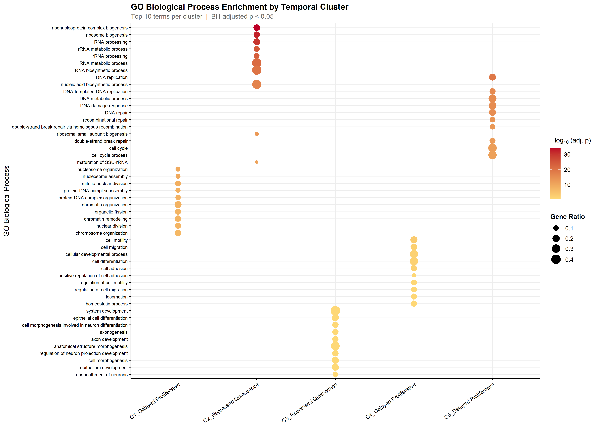
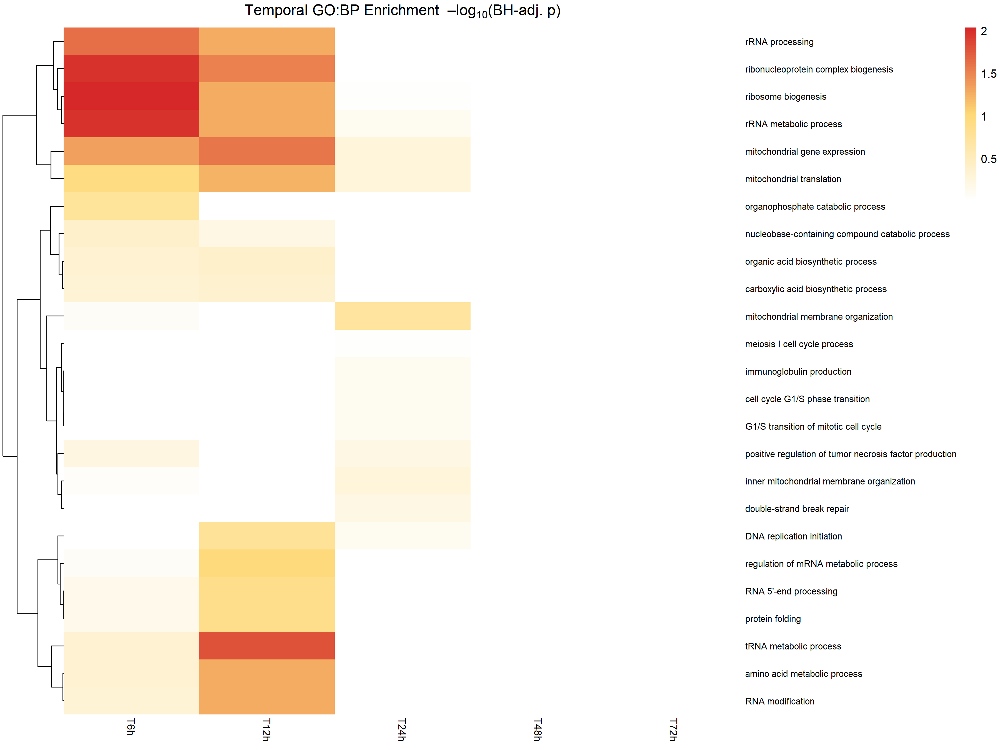

```{r}
#| label: setup
#| cache: false

library(targets)
library(dplyr)
library(ggplot2)
library(knitr)
library(kableExtra)

# Load all pipeline results from the targets store
tar_load(c(
  sample_meta,
  counts_filtered,
  vst_matrix,
  res_interaction,
  res_activated,
  deg_categories,
  pairwise_contrasts,
  final_clusters,
  cluster_comparison,
  pathway_go,
  pathway_kegg,
  temporal_pathway_matrix
))

knitr::opts_chunk$set(
  fig.align = "center",
  out.width = "100%"
)
```

# Background and Motivation {#sec-background}

T lymphocyte activation is a tightly choreographed transcriptional programme.
Upon engagement of the T-cell receptor (TCR) and co-stimulatory signals
(CD28), resting naïve T-cells undergo a profound metabolic and epigenetic
reprogramming within the first 72 hours — transitioning from quiescence to
rapid proliferation and acquisition of effector functions
[@Rade2023; @Wherry2011].

Understanding the **temporal structure** of this response — *which genes
change early vs. late, and whether those dynamics are truly stimulation-driven
or merely passive culture effects* — is central to designing effective
immunotherapies, including CAR-T cell manufacturing optimisation.

Classical pairwise comparisons (activated vs. control at a single time point)
cannot distinguish:

- Genes with a **stimulation-specific trajectory** (interaction effect)
- Genes whose change over time is **mirrored in the unstimulated control**
  (temporal drift, not stimulation-driven)

Here we apply a **Likelihood Ratio Test (LRT) with natural spline basis** to
formally test the *condition × time interaction*, following the approach
recommended by @Schulz2018 for time-series RNA-Seq data.

---

# Dataset {#sec-dataset}

```{r}
#| label: tbl-dataset
#| tbl-cap: "Study design summary — GSE197067 (Rade et al. 2023)"

design_tbl <- sample_meta |>
  dplyr::count(condition, time_hours) |>
  tidyr::pivot_wider(names_from = condition, values_from = n) |>
  dplyr::rename(`Time (h)` = time_hours,
                Activated  = activated,
                Control    = control)

knitr::kable(design_tbl, align = "c") |>
  kableExtra::kable_styling(bootstrap_options = c("striped","hover"),
                             full_width = FALSE)
```

**Key design parameters:**

- **GEO Accession:** GSE197067
- **Publication:** Rade *et al.* (2023) *Genome Biology*, PMID 37974140
- **Stimulus:** Anti-CD3/CD28 bead activation (72-hour kinetics)
- **Replicates:** 4 healthy donors (biological replicates)
- **Pre-processing:** Raw counts from GEO; CPM ≥ 1 in ≥ 3 samples filter

```{r}
#| label: fig-pca
#| fig-cap: "PCA of VST-transformed counts. PC1 separates activated from control samples; PC2 captures temporal progression. Ellipses = 90% confidence intervals per condition."


```

```{r}
#| label: fig-sample-dist
#| fig-cap: "Sample-to-sample Euclidean distance heatmap reveals tight donor clustering within each condition × time group."


```

---

# Statistical Methods {#sec-methods}

## Model 1 — Interaction LRT (Primary) {#sec-model1}

$$
\underbrace{\sim \text{donor} + \text{condition} + \text{ns}(\text{time}, df=3)}_{\text{Reduced}} + \underbrace{\text{condition} \times \text{ns}(\text{time}, df=3)}_{\text{Interaction terms}}
$$

The LRT statistic has **3 degrees of freedom** (one per spline basis column).
A significant result means the *shape* of the temporal trajectory differs
between activated and control T-cells. Implemented with
`DESeq2::DESeq(test="LRT")` and `fitType="glmGamPoi"` for speed.

## Model 2 — Activated-only LRT (Secondary) {#sec-model2}

$$
\sim \text{donor} + \text{ns}(\text{time}, df=3) \quad \text{vs} \quad \sim \text{donor}
$$

Applied to activated samples only. Identifies genes that change over time
**within the activation programme**, regardless of control.

## DEG Classification {#sec-deg-class}

Cross-referencing the two LRT gene lists produces three categories:

| Category | Definition |
|---|---|
| **Stimulation-specific** | Interaction LRT sig; activated-only NOT sig |
| **General activation** | Significant in both LRTs |
| **Temporal only** | Activated-only sig; interaction NOT sig |

## Pairwise Contrasts (Tertiary) {#sec-pairwise}

`lfcShrink(type="ashr")` applied at each time point (6h, 12h, 24h, 48h, 72h)
vs. the corresponding control. Provides accurate per-time-point effect sizes
for volcano plots and early/late responder identification.

---

# Differential Expression Results {#sec-de-results}

```{r}
#| label: tbl-deg-summary
#| tbl-cap: "DEG summary across all analyses (FDR < 0.05)"

tibble::tribble(
  ~Analysis,                       ~`FDR < 0.05`,   ~`|LFC| ≥ 1`,
  "Interaction LRT (condition×time)",
    sum(!is.na(res_interaction$padj) & res_interaction$padj < 0.05),
    sum(!is.na(res_interaction$padj) & res_interaction$padj < 0.05 &
          abs(res_interaction$log2FoldChange) >= 1),
  "Activated-only LRT",
    sum(!is.na(res_activated$padj) & res_activated$padj < 0.05),
    NA_integer_,
  "Stimulation-specific",
    length(deg_categories$stimulation_specific), NA_integer_,
  "General activation",
    length(deg_categories$general_activation), NA_integer_,
  "Temporal only",
    length(deg_categories$temporal_only), NA_integer_
) |>
  knitr::kable(align = c("l","r","r")) |>
  kableExtra::kable_styling(bootstrap_options = c("striped","hover"),
                             full_width = FALSE) |>
  kableExtra::row_spec(1, bold = TRUE, background = "#f0f8ff")
```

```{r}
#| label: fig-volcano
#| fig-cap: "Volcano plots at 6h, 24h, and 72h. Top labelled genes represent the strongest statistically and biologically significant responders."


```

```{r}
#| label: fig-ma
#| fig-cap: "MA plot for the interaction LRT. The loess curve confirms no systematic mean-expression bias in the test statistic."


```

## Top Interaction DEGs {#sec-top-degs}

```{r}
#| label: tbl-top-degs
#| tbl-cap: "Top 20 interaction LRT DEGs ordered by adjusted p-value"

res_interaction |>
  dplyr::filter(!is.na(padj)) |>
  dplyr::arrange(padj) |>
  dplyr::slice_head(n = 20) |>
  dplyr::select(gene_id, baseMean, log2FoldChange, stat, pvalue, padj) |>
  dplyr::mutate(
    baseMean       = round(baseMean, 1),
    log2FoldChange = round(log2FoldChange, 3),
    stat           = round(stat, 2),
    pvalue         = formatC(pvalue, format="e", digits=2),
    padj           = formatC(padj,   format="e", digits=2)
  ) |>
  knitr::kable(
    col.names = c("Gene","Base Mean","LFC (LRT)","LRT stat","p-value","adj. p"),
    align     = c("l","r","r","r","r","r")
  ) |>
  kableExtra::kable_styling(bootstrap_options = c("striped","hover","condensed"),
                             full_width = FALSE, font_size = 12)
```

---

# Temporal Clustering {#sec-clustering}

## Clustering Strategy {#sec-cl-strategy}

We applied three independent clustering methods to the top interaction DEGs
(FDR < 0.05, |LFC| ≥ 1) and compared solutions using the **Adjusted Rand
Index (ARI)**. Using multiple methods guards against algorithm-specific
artefacts and identifies robust, reproducible trajectory groups.

| Method | Input | Algorithm |
|---|---|---|
| **Mfuzz** | Z-scored mean VST per time point | Fuzzy c-means (soft assignment) |
| **NMF** | Shifted VST (non-negative) | Brunet algorithm, rank = 5 |
| **Spline k-means** | Cubic spline coefficients per gene | Euclidean k-means on shape |

```{r}
#| label: fig-ari
#| fig-cap: "ARI concordance matrix between the three clustering methods. Values approaching 1.0 indicate strong agreement."


```

```{r}
#| label: tbl-ari
#| tbl-cap: "Pairwise Adjusted Rand Index between clustering solutions"

round(cluster_comparison$ari_matrix, 3) |>
  knitr::kable() |>
  kableExtra::kable_styling(bootstrap_options = "striped", full_width = FALSE)
```

## Cluster Trajectories {#sec-cl-trajectories}

```{r}
#| label: tbl-cluster-sizes
#| tbl-cap: "Mfuzz cluster assignments and trajectory labels"

tibble::tibble(
  `Cluster ID`     = as.integer(names(final_clusters$trajectory_labels)),
  `Trajectory`     = as.character(final_clusters$trajectory_labels),
  `Gene Count`     = as.integer(table(final_clusters$cluster_hard)[
                       names(final_clusters$trajectory_labels)])
) |>
  dplyr::arrange(`Cluster ID`) |>
  knitr::kable(align = c("c","l","r")) |>
  kableExtra::kable_styling(bootstrap_options = c("striped","hover"),
                             full_width = FALSE)
```

```{r}
#| label: fig-trajectories
#| fig-cap: "Mean ± SEM expression trajectories for each temporal cluster in activated T-cells. Faint lines = random sample of individual genes (n ≤ 35)."


```

```{r}
#| label: fig-heatmap
#| fig-cap: "Cluster heatmap of top-membership genes in activated samples, ordered by cluster then time. Expression is z-scored and capped at ±3."


```

---

# Pathway Interpretation {#sec-pathways}

## Per-Cluster GO Enrichment {#sec-go-cluster}

```{r}
#| label: fig-dotplot
#| fig-cap: "GO:BP dot plots for each temporal cluster. Point size = gene ratio; colour = enrichment significance."


```

```{r}
#| label: tbl-top-pathways
#| tbl-cap: "Top GO:BP terms per cluster (BH-adjusted p < 0.05)"

purrr::map_dfr(names(pathway_go), function(cl_name) {
  enr <- pathway_go[[cl_name]]
  if (is.null(enr) || nrow(enr@result) == 0) return(NULL)
  enr@result |>
    dplyr::filter(p.adjust < 0.05) |>
    dplyr::arrange(p.adjust) |>
    dplyr::slice_head(n = 5) |>
    dplyr::select(Description, GeneRatio, BgRatio, p.adjust, geneID) |>
    dplyr::mutate(
      Cluster    = cl_name,
      p.adjust   = formatC(p.adjust, format="e", digits=2),
      geneID     = stringr::str_trunc(geneID, 60)
    )
}) |>
  dplyr::select(Cluster, Description, GeneRatio, p.adjust, geneID) |>
  knitr::kable(col.names = c("Cluster","GO Term","Gene Ratio","adj. p","Genes")) |>
  kableExtra::kable_styling(bootstrap_options = c("striped","condensed"),
                             full_width = TRUE, font_size = 11) |>
  kableExtra::column_spec(1, bold = TRUE)
```

## Temporal Pathway Dynamics {#sec-temporal-pathways}

```{r}
#| label: fig-temporal-pathway
#| fig-cap: "Temporal GO:BP enrichment heatmap. Each column represents a time point (activated vs control). Colour intensity = –log10(BH-adjusted p)."


```

### Biological Interpretation

The temporal enrichment map reveals the expected three-phase activation
programme:

**Phase I — Immediate (≤ 6h):** TCR signalling, NF-κB cascade, cytokine
production (*Early Innate Burst* cluster). These represent the primary
signal transduction response to CD3/CD28 ligation.

**Phase II — Intermediate (12–24h):** Metabolic reprogramming — glycolysis
upregulation, oxidative phosphorylation, amino acid biosynthesis
(*Transient Metabolic* and *Sustained Inflammatory* clusters). The Warburg
shift fuels biosynthetic demands of a dividing T-cell.

**Phase III — Late (48–72h):** Cell cycle entry, DNA replication, mitosis
(*Delayed Proliferative* cluster). Consistent with the ∼48h onset of
proliferation after TCR stimulation observed by CFSE dilution.

**Repressed programmes:** FOXO transcription factor targets, quiescence
maintenance, and metabolic restriction pathways are sustainably downregulated
(*Repressed Quiescence* cluster) — consistent with exit from naive quiescence.

---

# Limitations and Future Directions {#sec-limitations}

## Current Limitations

1. **Small donor cohort (n = 4):** Power to detect subtle donor × condition
   interactions is limited. LFCshrink partially mitigates this but
   fold-changes at individual time points carry uncertainty.

2. **Bulk, not single-cell:** Inter-cell heterogeneity is averaged. CD4⁺/CD8⁺
   subset-specific responses are invisible to this analysis.

3. **In vitro activation:** Anti-CD3/CD28 beads provide a supraphysiological
   stimulus. *In vivo* TCR signalling dynamics (peptide-MHC, variable
   co-stimulation) may differ substantially.

4. **Transcriptomics only:** Protein abundance and post-translational
   regulation are not captured. Translational lag may delay protein-level
   effects by 4–12h relative to mRNA peaks.

## What I Would Do With More Resources

| Resource | Analysis |
|---|---|
| scRNA-seq (10x) of same activation | Resolve CD4/CD8 subset-specific trajectories; identify rare responder populations |
| CITE-seq (protein + RNA) | Quantify translational lag; validate surface marker dynamics |
| CRISPR pooled screen (activated T-cells) | Functional validation of sustained inflammatory hub genes |
| CAR-T infusion product scRNA-seq | Test if GSE197067 activation signatures predict in vivo CAR-T fitness |
| Proteomics (TMT-MS) at 6h/24h/72h | Cross-validate transcriptional clusters at protein level |

---

# Reproducibility {#sec-repro}

## Pipeline

This analysis was fully orchestrated with the `targets` R package. To
reproduce from scratch:

```bash
git clone https://github.com/YOUR_USERNAME/tcell-activation-dynamics
cd tcell-activation-dynamics
Rscript -e "renv::restore()"
Rscript -e "targets::tar_make()"
```

## Session Information {#sec-session}

```{r}
#| label: session-info
#| cache: false
#| code-fold: false

sessionInfo()
```

---

# References {#sec-references}
